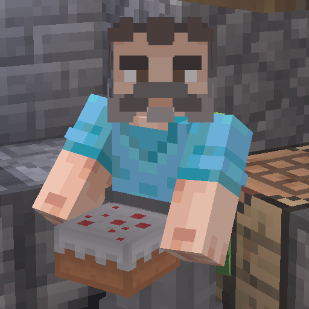

# Carry Cake and Pie

Cake and pumpkin pie for you!

> **Important**
> - Required [Babric](https://github.com/Turnip-Labs/babric-instance-repo/releases) to run the mod.
> - Required [HalpLibe](https://github.com/Turnip-Labs/bta-halplibe/releases) in BTA version 7.1 and later.

## Features

- `Shift` + `Right Click` at a cake or a pumpkin pie to carry it around.

## Compatibility Table

| Client | Server | Behavior                                                                                                                                     |
|--------|--------|----------------------------------------------------------------------------------------------------------------------------------------------|
| ✅      | ❌      | You will eat the original cake/pie, and will pick it up _visually_. (meaning you are not actually holding it, it's just a visual glitch) |
| ❌      | ✅      | You will pick it up.                                                                                                                         |
| ✅      | ✅      | You will pick it up.                                                                                                                         |
